Data visualization using ggplot
================
Solveig Bjørkholt
7. July

# Plan for today

## What we will learn today:

-   Why to visualize data
-   Exploratory and explanatory data visualization
-   How to visualize data with `ggplot`
    -   Histogram
    -   Bar plot
    -   Scatterplot
    -   Line plot
    -   Boxplot
    -   Customization of plot

# Why to visualize data

Graphs are the most effective tools a data scientist can use to
communicate their findings. With a graph[^1], you can quickly create an
overview of important findings and draw attention to the most important
parts in data. Yet, of course, the effectiveness of the graph depends on
the particular graph. There are many bad graphs out there, as the plot
on the left below shows you (the so-called “WTF-plot”).

Actually, bad plotting is such a common practice that the R-community
has thought they might as well create some fun from it. The
[R-ladies](https://rladies.org/), for example, host occasional “ugly
plot” contests, featuring fabulously ugly plots, such as the one to the
right below.


But what is it that makes these plots so bad? Actually, it’s all about
information transfer again. Except this time it is not from computer to
computer or from computer to human, it is from human to human.

When we communicate results, we want to transfer information on our
findings from ourselves to another human being as quickly and smoothly
as possible. Since human beings are quite good at processing visual
information, we create graphs. However, human beings also struggle when
they have to take in a lot of information without understanding the
general purpose of the information. We are wired for stories, which is
why our ancient ancestors typically communicated knowledge through
stories, myths and fables. This ancient wiring is why we want to utilize
storytelling to create plots that contribute neatly to our information
transfer.

# Why make a visualization

Before we embark on how to create good, understandable plots, we should
remember that there is a difference between exploratory and explanatory
analysis. Exploratory data analysis (EDA) is what the name suggests –
exploration of data. It’s about creating different plots to get an
overview. It enables you to see trends, patterns, and outliers.
Explanatory analysis, on the other hand, is about using plots to
communicate your findings to others. In the exploratory phase, an ugly
plot is only a nuisance to yourself. In explanatory analysis, it is much
more important that the plot is good enough for others to easily
understand what you are trying to communicate.

## Exploratory visualization

Exploratory data analysis (EDA) is often done by simply making a lot of
different plots. We will learn how to do that later. However, it is
worth noting that R also has different packages you can use for
exploratory data analysis, for example `DataExplorer`, `GGally`,
`SmartEDA` and `tableone`. Below is an example with the package `GGally`
using the dataset `gapminder`, which contains data on life expectancy
(lifeExp), population size (pop) and GDP per capita (gdpPercap) for
different countries and continents over several years. The package
compares different variables over two values – in this case it compares
countries in Europe and Asia.

For these plots, we can for example see that life expectancy in Asian
countries is lower than in European countries, and that GDP per capita
is higher in European countries (except for one Asian outlier).
Population size is slightly higher in Asia, and especially so for two
outliers.

``` r
library(GGally)

options(scipen=999) # To get full numbers instead of scientific numbers

gapminder <- gapminder::gapminder %>%  # Loading the dataset "gapminder" from the package "gapminder". The notation :: means "use function from package".
  filter(continent %in% c("Asia", "Europe")) %>% # Picking the values "Asia" and "Europe" from the variable "continent"
  group_by(continent, country) %>% # Group after continent and country to aggregate
  summarise(lifeExp = sum(lifeExp, na.rm = TRUE), # Aggregate to sum using "summarise", getting the sum of lifeExp, pop and gdpPercap for all years
            pop = sum(pop, na.rm = TRUE),
            gdpPercap = sum(gdpPercap, na.rm = TRUE)) %>%
  ungroup() %>% # Ungrouping from continent and country
  select(continent, lifeExp, pop, gdpPercap) # Creating dataframe with only the variables continent, lifeExp, pop and gdpPercap

gapminder %>% 
  ggpairs(mapping = aes(color = continent, alpha = 0.5)) + 
  theme(axis.text.x = element_text(angle = 60, hjust = 1))
```

<!-- -->

## Explanatory visualization

In explanatory visualization, you want to communicate your findings. In
this case, it is important to be aware of three things:

1.  **Who** are you communicating to? Is it researchers in political
    science, students in physics, employees in the public sector, people
    in the age group 19-30? Try to make your target group as specific as
    possible. It is also useful to think about your relation to the
    audience and situate yourself.
2.  **What** do you need your audience to know or to do? Articulate this
    in writing or out loud before you start making your plot. It’s also
    useful to think about the medium for the plot (e.g. presentation or
    webpage) and the tone you want to set (e.g. professional, engaged,
    optimistic).
3.  **How** should the plot look? Do we want a line graph or a bar plot,
    which variables should we plot, which colors do we choose, where
    should the title be, and so on.

The rest of this document will be focused on the “how” part. The figure
below is taken from the book *Storytelling with data*, which offers a
good introduction on when to use the different types of graphs.


We’ll be looking at how to make some of these plots in R. A useful thumb
of rule to begin with, is to note which variables you need to use in
order to communicate your results. Once you know which variables need,
you can pick a plot based on the variable types. Recall that categorical
variables have values that differ from each other but cannot be ranked
(e.g. “blue” and “red”), while continuous variables can be ranked
(e.g. 1, 2, 3, 4, 5…). Here is a small overview on how we can pick plots
based on variable types:

-   **Bar plot**: Categorical variables, sometimes including continuous
    ones.
-   **Scatterplot**: Two continuous variables.
-   **Line plot**: Two continuous variables, typically one of them being
    temporal (e.g. years or dates).
-   **Boxplot**: One categorical variable and one continuous variable.

# Visualization with `ggplot2`

`ggplot2` is the go-to package to work with plots in R[^2]. You can
create almost any plot with this package, from the most simple ones to
very advanced plots.

## The `ggplot` philosophy

The basic idea of `ggplot` is that a plot is a series of layers that you
put on top of each other. Imagine it like an empty canvas, and like a
painter, you add layer upon layer until you have a complete graph. In
particular, `ggplot` needs three layers to give us something functional.
Below, we will show how this might look using the dataset `gapminder`
again.

**Layer 1** The first layer is the empty canvas. It looks like a blank
slate where anything can be drawn, but it is confined to the data you
want to use. In other words, in the first layer, you decide which data
you want. You initiate this by calling `ggplot()` on the name of the
dataset you are using.

``` r
library(ggplot2)

gapminder::gapminder %>%
  ggplot()
```

<!-- -->

**Layer 2** In the second layer, we need to tell `ggplot` which
variables from the dataset we want to plot. We use the function `aes()`
inside the `ggplot()` function to do this. Here, we tell `ggplot` to
plot the variable “lifeExp”. Notice how the variable has become present
on the X-axis of the plot.

``` r
gapminder::gapminder %>%
  ggplot(aes(lifeExp))
```

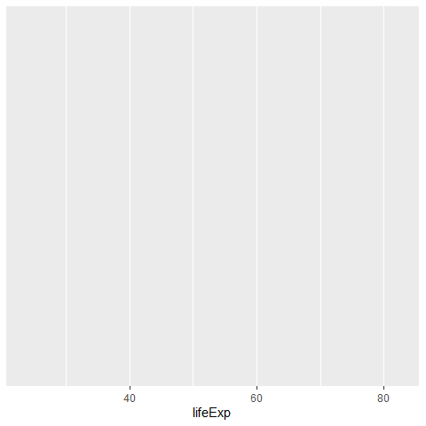<!-- -->

**Layer 3** In the last layer, need to tell `ggplot` which type of plot
we want. These are specified using the `geom_` function. For example, if
we want a histogram, we write `geom_histogram`. We’ll learn a few other
plot types below.

``` r
gapminder::gapminder %>%
  ggplot(aes(lifeExp)) +
  geom_histogram()
```

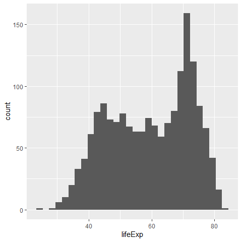<!-- -->

Now we have a fully functional plot! This plot tells us the life
expectancy for different countries over different years. More
technically, it shows us how many times different values on the
“lifeExp” variable occur in the dataset. The most common life expectancy
for countries in the world between the years 1952 and 2007 appears to be
about 70 years.

To recap, here are the three basic commands and functions for `ggplot`:

| Layer   | Command                            | Function |
|---------|------------------------------------|----------|
| Layer 1 | Initiate the plot, decide the data | ggplot() |
| Layer 2 | Add the variables                  | aes()    |
| Layer 3 | Decide on the plot type            | geom()   |

## Different plot types

In this section, I present the basic build for some different plot
types, and then show some ways to modify the plots to make them look
better.

### Some repetition: Getting data for plotting

Let’s look at other types of plot. And to do this, we’ll use data from
Eurostat. As we learned yesterday, Eurostat has an API we can use to
gather data. Using this API, we download two datasets on European
countries over different industries and years; one dataset on greenhouse
gas emissions and one dataset on money spent on research and development
(R&D).

What is the relationship between R&D-spending and greenhouse gas
emission for different countries, for different industries, and over
time?

Below follows some repetition on the use of API, data processing and
joining.

``` r
library(eurostat)

green <- get_eurostat("env_ac_ainah_r2", # The dataset "Air emissions accounts by NACE Rev. 2 activity"
                      filters = list(airpol = c("GHG", "CO2"), # Which air pollutant do we want? Picking the category "Greenhouse gases (GHG)" and "CO2"
                                     nace_r2 = c("A", "B", "C", "D_E", "F", "G", "H", "I", "J", "K", "L68", "M_N", "O_P", "Q", "R", "S-U", "TOTAL"), # Which industries do we want? Picking industries from category A to U.
                                     unit = "G_HAB", # Which measure do we want? Picking "Grams per capita (G_HAB)"
                                     time = c("2010", "2011", "2012", "2013", "2014", "2015", "2016", "2017", "2018", "2019", "2020"))) # Picking data for 10 years, 2010 to 2020.

green <- green %>% # Data is processed to merge.
  pivot_wider(names_from = "airpol", values_from = "values") %>% # Pivoting (spreading) the categories "GHG" and "CO2" on the "airpol" variable into two different columns
  select(-c(unit)) %>% # Removing the columns "unit" since we do not need it anymore, and they do not exist in the other dataset, so cannot be merged.
  mutate(time = str_extract(time, "[0-9]{4}"), # Taking out the part of the string that has four numbers in a row, i.e. the year.
         time = as.numeric(time)) # Converting the year to numeric, since processing is often quicker then.

research <- get_eurostat("rd_e_berdindr2", # The dataset "BERD by NACE Rev. 2 activity"
                         filters = list(nace_r2 = c("A", "B", "C", "D_E", "F", "G", "H", "I", "J", "K", "L68", "M_N", "O_P", "Q", "R", "S-U", "TOTAL"), # Which industries do we want? Picking industries from category A to U.
                                        unit = "EUR_HAB", # Which measure do we want? Picking "Euro per inhabitant (EUR_HAB)"
                                        time = c("2010", "2011", "2012", "2013", "2014", "2015", "2016", "2017", "2018", "2019", "2020"))) # Picking data for 10 years, 2010 to 2020.

research <- research %>% # Data is processed for merge -- same procedure as above.
  rename(rnd = values) %>%
  select(-unit) %>%
  mutate(time = str_extract(time, "[0-9]{4}"),
         time = as.numeric(time))

green_research <- left_join(green, research, by = c("geo", "time", "nace_r2"))

green_research <- green_research %>%
  select(geo, time, nace_r2, GHG, CO2, rnd) %>% # This is just to get the columns in a nicer order
  rename(industry = nace_r2) %>% # Renaming the column on industry type to something more intuitive
  mutate(industry = recode(industry, 
                           "A" = "Agriculture, Forestry and Fishing",
                           "B" = "Mining and Quarrying",
                           "C" = "Manufacturing",
                           "D_E" = "Electricity and Water supply",
                           "F" = "Construction",
                           "G" = "Wholesale and Retail Trade",
                           "H" = "Transportation and Storage",
                           "I" = "Accommodation and Food Service Activities",
                           "J" = "Information and Communication",
                           "K" = "Financial and Insurance Activities",
                           "L68" = "Real estate",
                           "M_N" = "Professional, Scientific, Technical and Administrative",
                           "O_P" = "Public Administration, Defence and Education",
                           "Q" = "Human Health and Social Work Activities",
                           "R" = "Arts, Entertainment and Recreation",
                           "S-U" = "Others, incl. household"))

green_research %>%
  head() # Showing the first six rows of the data 
```

    ## # A tibble: 6 x 6
    ##   geo    time industry                              GHG     CO2   rnd
    ##   <chr> <dbl> <chr>                               <dbl>   <dbl> <dbl>
    ## 1 AT     2010 Agriculture, Forestry and Fishing 952971. 106674.  NA  
    ## 2 AT     2011 Agriculture, Forestry and Fishing 956632. 105830.   0.2
    ## 3 AT     2012 Agriculture, Forestry and Fishing 944788. 104150.  NA  
    ## 4 AT     2013 Agriculture, Forestry and Fishing 941027. 105088.   0.4
    ## 5 AT     2014 Agriculture, Forestry and Fishing 949435. 104398.  NA  
    ## 6 AT     2015 Agriculture, Forestry and Fishing 939484. 103256.   0.3

### Bar plots

Bar plots work well if the main thing you want to come across to the
audience has to do with categorical variables. We have already been
introduced to `geom_histogram`, which is a type of bar plot that is
ideal if you have only one variable where it makes sense to count the
occurrences of values on that variable.

To plot two variables against each other in a bar plot, we use
`geom_bar()`. We could for example look at how emission of greenhouse
gas varies between countries. However, plotting only:

``` r
green_research %>%
  ggplot(aes(geo, GHG)) +
  geom_bar()
```

would yield an error message saying “stat_count() can only have an x or
y aesthetic.” This is because `geom_bar` tries to count the occurrences
of variable, but now there are two variables in the code. Which to
count?? The solution is to add `stat = "identity"` inside `geom_bar()`.
Now, `ggplot` knows that it should plot the first variable on the X-axis
and the second variable on the y-axis. This gives us the distribution of
greenhouse gas emission by country for all years for all industries.

``` r
green_research %>%
  ggplot(aes(geo, GHG)) +
  geom_bar(stat = "identity")
```

<!-- -->

The above plot is bundled up in a way that makes it difficult to
interpret. Adding together all years and industries without showing them
in the plot, clouds the results.

Here, I show three different solutions to this, including some plot
customization.

1.  One solution to this is to use `filter` to get only one year and one
    industry category. Let’s look at the industry category “TOTAL”
    (which means we get the complete greenhouse gas emissions for all
    industries) for the year 2018. In this plot, we also use
    `fct_reorder` to get the bars in a more readable order, and
    `coord_flip` to flip the plot around, making the names of the
    countries more readable.

``` r
green_research %>%
  filter(time == 2018) %>% # Picking the year 2018
  filter(industry == "TOTAL") %>% # Picking the category "TOTAL"
  filter(!geo %in% c("TR", "RS")) %>% # Removing countries with no values
  ggplot(aes(fct_reorder(geo, GHG), GHG)) + # Using fct_reorder to change the order to the bars so that the biggest one comes first
  geom_bar(stat = "identity") +
  coord_flip() # Flipping the plot to get the X-axis on the Y-axis
```

<!-- -->

2.  Another alternative is to aggregate the results. For example,
    instead of picking the year 2018 to show in the plot, we can find
    the sum of greenhouse gas emission for all years, from 2010 to 2020,
    per country. Again, we `filter` out the industry category “TOTAL”,
    and then we use `group_by` and `summarise` to find the total sum of
    greenhouse gas emissions from 2010 to 2020 grouped by country.

``` r
aggregate_emission <- green_research %>%
  filter(industry == "TOTAL") %>% # Picking the industry category "TOTAL"
  group_by(geo) %>% # Find aggregates grouped by the geo variable (i.e. countries)
  summarise(total_emission = sum(GHG, na.rm = TRUE)) # Aggregate up total emissions using sum(), also specifying na.rm = TRUE to look past missing values

aggregate_emission %>% 
  head() # Showing the first six rows of the new dataset
```

    ## # A tibble: 6 x 2
    ##   geo   total_emission
    ##   <chr>          <dbl>
    ## 1 AT         74393567.
    ## 2 BE         93218935.
    ## 3 BG         85778995.
    ## 4 CH         44345741.
    ## 5 CY         89642549.
    ## 6 CZ        111038210.

``` r
aggregate_emission %>%
  filter(!geo %in% c("TR", "RS")) %>% 
  ggplot(aes(fct_reorder(geo, total_emission), total_emission)) +  
  geom_bar(stat = "identity") + 
  coord_flip() 
```

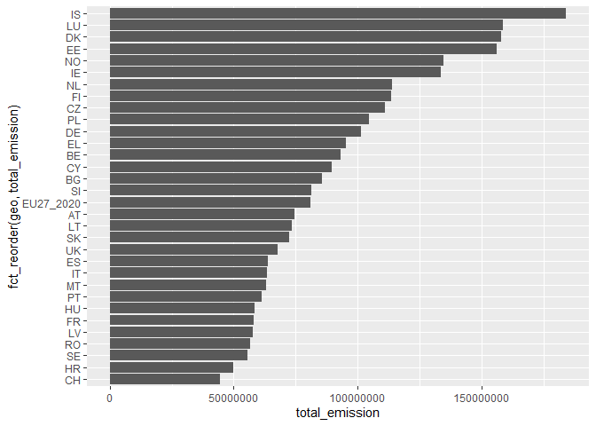<!-- -->

3.  Lastly, we can choose to plot the extra variables in addition to the
    ones we already have in the bar plot. To do this, we use the `fill`
    argument. This argument alone would create a stacked bar plot. To
    get the bars next to each other, add the argument
    `position = "dodge"` inside `geom_bar()` This way, we get bars of a
    different category beside each other for each category. This quickly
    creates a ton of bars, so in the plot below, I choose to `filter`
    out only Germany (DE), the United Kingdom (UK) and France (FR). Now
    we get the greenhouse gas emission per industry per country for
    2018.

``` r
green_research %>%
  filter(time == 2018) %>% # Picking the year 2018 again
  filter(industry != "TOTAL") %>% # Removing the category "TOTAL"
  filter(geo %in% c("DE", "FR", "UK")) %>% # Picking the countries DE, FR and UK
  ggplot(aes(geo, GHG, fill = industry)) +  # fill = industry adds a third variable to the plot -- industry
  geom_bar(stat = "identity", position = "dodge") + # position = "dodge" places the bars next to each other
  coord_flip() 
```

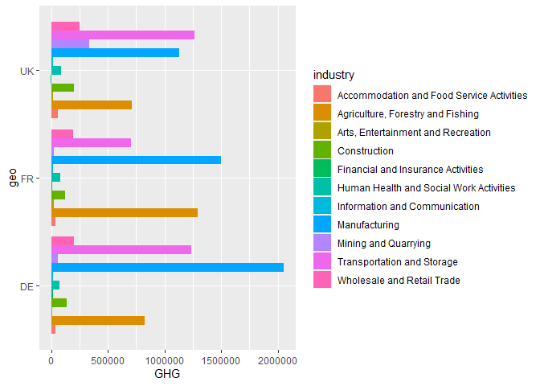<!-- -->

### Scatterplots

Scatterplots work excellently if the main thing you want to show is the
relationship between two or more continuous variables. To make a
scatterplot, you add the argument `geom_point`. For example, we can look
at the relationship between greenhouse gas emissions and effort on
research and development.

``` r
green_research %>%
  ggplot(aes(GHG, rnd)) + 
  geom_point()
```

<!-- -->

Looks like there’s a slight positive relationship between greenhouse gas
emission and R&D-spending. Could it be that the more emission an
industry has, the more it also spends on R&D? Let’s add a trend-line to
the graph to see the relationship clearer. This, we do by simply adding
`geom_smooth` as an extra layer to the plot. I also `filter` away the
“TOTAL” category on the “industry” variable, because it does not make
sense to compare the total emission of industries to individual
categories of industries.

``` r
green_research %>%
  filter(industry != "TOTAL") %>% # Removing the "TOTAL" category
  ggplot(aes(GHG, rnd)) + 
  geom_point() + 
  geom_smooth() # Adding a trend-line to the data
```

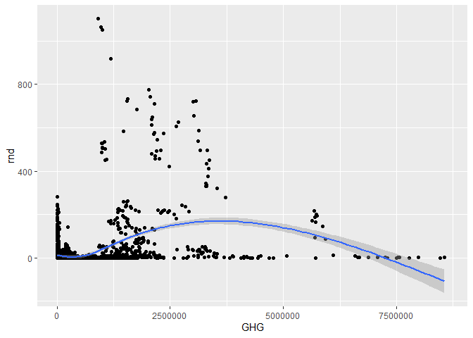<!-- -->

Looks like there’s a lot of variation among the different industry
categories. To make this clearer, we can add another variable to the
plot by coloring the dots after which category they belong to. We can
for example color them after industry category. To do this, add `color`
to the `aes()` argument, and specify which variable you want (should
ideally be a categorical variable). We can also change the trend-line to
become linear by adding the argument `method = "lm"` inside
`geom_smooth()`. Doing this while also having the `color` argument will
create one trend-line for each category.

``` r
green_research %>%
  filter(industry != "TOTAL") %>% 
  ggplot(aes(GHG, rnd, color = industry)) + # Coloring the dots using color = industry
  geom_point() + 
  geom_smooth(method = "lm") # Making the trend-line linear
```

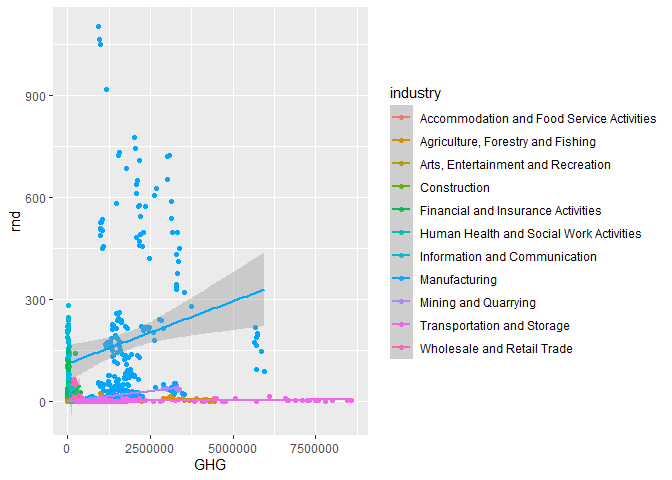<!-- -->

Looks like the manufacturing-industries spend more on research and
development than companies within transportation and storage, despite
both polluting quite a lot compared to the other industry categories.
However, is this dependent on which type of pollution we’re talking
about? We can look at this by adding a fourth variable to the plot.
Scatterplots can be converted into bubbleplots by specifying the `size`
argument, and this way, they can actually show the relationship between
three continuous variables and one categorical! Below, I also use the
argument `alpha` to make the bubbles more transparent – the lower the
value, the more transparent.

``` r
green_research %>%
  filter(industry != "TOTAL") %>%
  ggplot(aes(GHG, rnd, color = industry, size = CO2)) + # Setting the size of the bubbles to CO2-emission
  geom_point(alpha = 0.3) + # alpha allows us to make the dots (bubbles) more transparent
  geom_smooth(method = "lm", size = 1) # Setting the size of the trend-line
```

<!-- -->

Want an even more exhausting plot? Let me tell you that we can add
another categorical variable, making our plot show the relationship
between three continuous variables and two categorical ones. We add
another layer, `geom_label` to convert the dots (or bubbles) into
labels. Then, using `aes()` again since we are calling a variable, we
specify `label`. To get complete information, I use `mutate` to create
new variable called “countryyear”, where I paste together values from
the variable “geo” and “time”. This is the variable I add to the `label`
argument.

``` r
green_research %>%
  mutate(countryyear = paste(geo, time)) %>% # Making a new variable composed of the strings from geo and time
  filter(industry != "TOTAL") %>%
  ggplot(aes(GHG, rnd, color = industry, size = CO2)) + 
  geom_point(alpha = 0.5) + 
  geom_label(aes(label = countryyear)) + # Makes the dots into labels, and fills the labels with values from the "countryyear" variable
  geom_smooth(method = "lm", size = 1) # Setting the size of the trend-line to 1
```

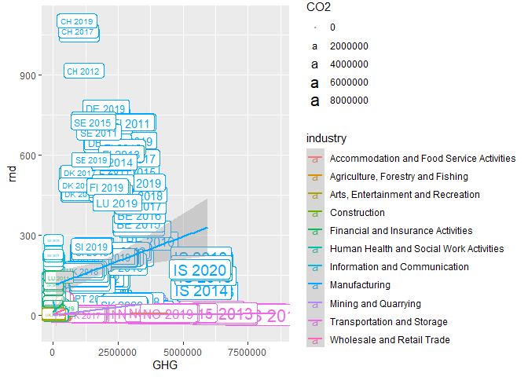<!-- -->

If you think this plot has a bit too much information already, you’re
probably right. Cognitive overload indeed.

### Line plots

Line plots are good for showing variation over time. They can be a bit
tricky to get working because they do an aggregation within the plot
functionality. However, the basic concepts are using `geom_line` and
specifying how many lines you want with the `group` argument. In the
example below, I also had to filter out the “TOTAL” category, because
the lines cannot handle multiple categories for each line.

``` r
green_research %>%
  filter(industry == "TOTAL") %>% # Picking the "TOTAL" category
  ggplot(aes(time, GHG, group = geo)) +  # Grouping by geo, i.e. getting one line per country
  geom_line() # Making a line plot
```

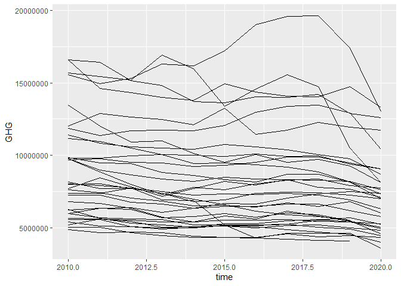<!-- -->

To know which line that belong to which country, we can also specify the
`color` argument. Here, I also convert the “time” variable into a factor
by using `mutate` and `as_factor`. This removes the decimals from the
year-values on the x-axis.

``` r
green_research %>%
  mutate(time = as_factor(time)) %>% # Making the variable into a factor, removing decimals
  filter(industry == "TOTAL") %>% 
  ggplot(aes(time, GHG, group = geo, color = geo)) + # Coloring the lines after country
  geom_line()
```

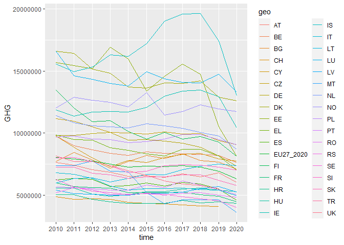<!-- -->

Line graphs have a tendency to become rather crowded. They turn into
“spagetthi-grams” as they say. One common solution to this is to filter
out just some countries.

``` r
green_research %>%
  mutate(time = as_factor(time)) %>% # Making the variable into a factor, removing decimals
  filter(geo %in% c("DE", "FR", "UK")) %>% # Filtering out some countries
  filter(industry == "TOTAL") %>% 
  ggplot(aes(time, GHG, group = geo, color = geo)) + # Coloring the lines after country
  geom_line(size = 1.5) # Setting the size of the line
```

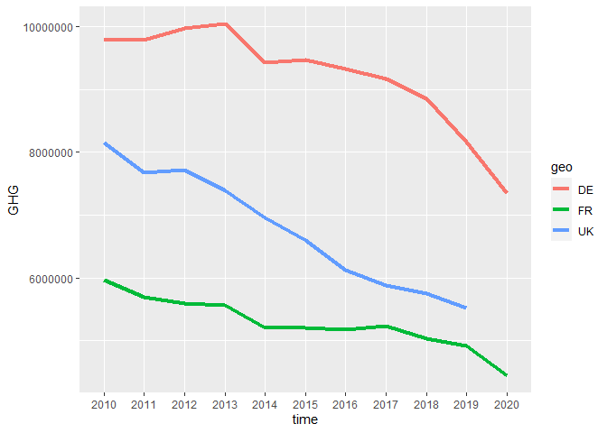<!-- -->

## Boxplot

Want to show the relationship between one categorical and one continous
variable? Then a boxplot might be ideal. It also shows outliers and
medians, so it can be quite handy. In a boxplot, the line in the middle
is the median, the white box is the 1st quantile and the 3rd quantile,
the lines show the range of the data, and the dots are outliers. To get
a boxplot, use `geom_boxplot`.

``` r
green_research %>%
  ggplot(aes(geo, GHG)) +
  geom_boxplot()
```

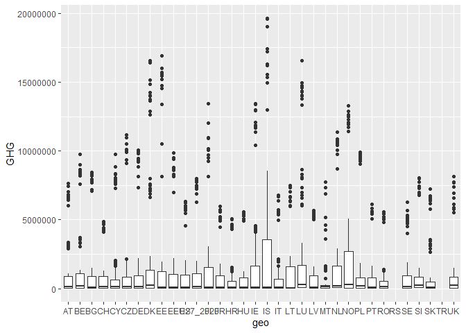<!-- -->

Boxplots can take some of the same arguments that we have already seen,
for example `coord_flip` to get the x-axis along the y-axis, and
`geom_label` with the argument `label` inside `aes` to form the dots
after a label in the dataset.

``` r
green_research %>%
  ggplot(aes(geo, GHG)) +
  geom_boxplot() + 
  geom_label(aes(label = time)) +
  coord_flip()
```

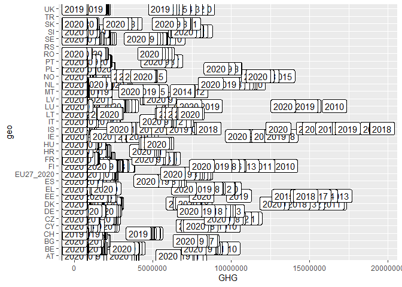<!-- -->

## Beautifying the plot

Once you know which plot you want to make, you can start customizing it
by creating titles, adding labels to the axes, choosing optimal colors,
nice background, moving the legends around, and so on. These functions
can be used for any plot.

### Titles and labels

You can add titles and lables to your plot. To do this, we use `labs`
with the argument `x` to specify the x-axis and `y` to specify the
y-axis. `ggtitle` allows us to add a title to the plot.

``` r
green_research %>%
  filter(time == 2018) %>% 
  filter(industry != "TOTAL") %>% 
  filter(geo %in% c("DE", "FR", "UK")) %>% 
  ggplot(aes(geo, GHG, fill = industry)) + 
  geom_bar(stat = "identity", position = "dodge") + 
  coord_flip() +
  labs(x = "Country", # Here we add names on the x-axis
       y = "Greenhouse gas emission") + # Here we add names on the y-axis
  ggtitle("Greenhouse gas emission in large European countries per industry, 2018") # Here we add a plot title
```

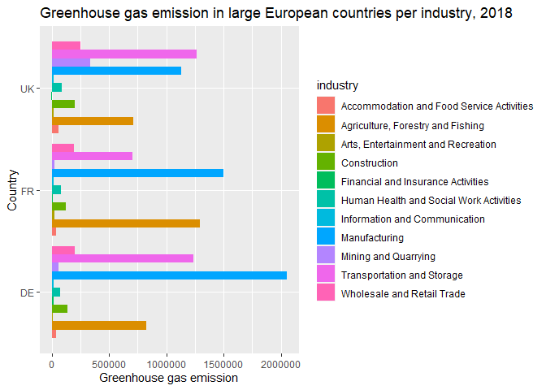<!-- -->

### Background

Not happy with the slightly grey, square shaped background in the plot?
`ggplot` has a number of different backgrounds we can choose, for
example `theme_bw`, `theme_minimal` and `theme_dark`. For a list of some
themes, you can refer to [this
link](https://ggplot2.tidyverse.org/reference/ggtheme.html).

``` r
green_research %>%
  filter(time == 2018) %>% 
  filter(industry != "TOTAL") %>% 
  filter(geo %in% c("DE", "FR", "UK")) %>% 
  ggplot(aes(geo, GHG, fill = industry)) + 
  geom_bar(stat = "identity", position = "dodge") + 
  coord_flip() +
  labs(x = "Country",
       y = "Greenhouse gas emission") + 
  ggtitle("Greenhouse gas emission in large European countries per industry, 2018") + 
  theme_bw() # We add another layer specifyinf which background we want for the plot
```

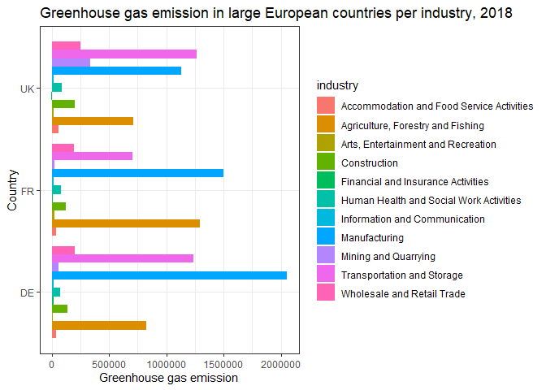<!-- -->

### Legends

The categories on the side are called legends. Whenever you use `fill`
or `color` or `size`, or any other function in `ggplot` that divides the
plot by some sort of category, you are going to get a legend.

In this plot, the legend shows which color on the bars that belongs to
which category on the industry-variable. Legends can be modified inside
`theme()`. In this case, I use the function `legend.position` with the
argument `"bottom"` to tell `ggplot` that I want the legend to be placed
on the bottom of the plot. Also notice that I change the name of the
variable to get a more intuitive sounding name on the legend.

``` r
green_research %>%
  filter(time == 2018) %>% 
  filter(industry != "TOTAL") %>% 
  filter(geo %in% c("DE", "FR", "UK")) %>% 
  rename("Economic category" = "industry") %>% # Changing the name of the category-variable.
  ggplot(aes(geo, GHG, fill = `Economic category`)) + # Now, the variable-name is "Economic category", so I change it. With a space in the name, I need to wrap the category in ``.
  geom_bar(stat = "identity", position = "dodge") + 
  coord_flip() +
  labs(x = "Country",
       y = "Greenhouse gas emission") + 
  ggtitle("Greenhouse gas emission in large European countries per industry, 2018") + 
  theme_bw() + 
  theme(legend.position = "bottom") # Placing the legend on the bottom
```

<!-- -->

There are many ways to modify the legend. If you want to remove the
legend altogether, you can give the `legend.position` function the
argument `"none"`.

``` r
green_research %>%
  filter(time == 2018) %>% 
  filter(industry != "TOTAL") %>% 
  filter(geo %in% c("DE", "FR", "UK")) %>% 
  ggplot(aes(geo, GHG, fill = industry)) + 
  geom_bar(stat = "identity", position = "dodge") + 
  coord_flip() +
  labs(x = "Country",
       y = "Greenhouse gas emission") + 
  ggtitle("Greenhouse gas emission in large European countries per industry, 2018") + 
  theme_bw() + 
  theme(legend.position = "none")
```

<!-- -->

### Colors

If you want to change the colors of the bar, this is done with the
argument `scale_`, adding to this function depending on what you want to
do. In the case below, I use `scale_fill_manual` because I’ve used the
argument `fill` above to define categories in the plot, and `manual`
because I want to choose the colors myself. Inside here, I define the
colors with the argument `values`. The names of the colors are diverse,
you can look at [this
page](https://www.nceas.ucsb.edu/sites/default/files/2020-04/colorPaletteCheatsheet.pdf)
for more information.

``` r
green_research %>%
  filter(time == 2018) %>% 
  filter(industry != "TOTAL") %>% 
  filter(geo %in% c("DE", "FR", "UK")) %>% 
  ggplot(aes(geo, GHG, fill = industry)) + 
  geom_bar(stat = "identity", position = "dodge") + 
  coord_flip() +
  labs(x = "Country",
       y = "Greenhouse gas emission") + 
  ggtitle("Greenhouse gas emission in large European countries per industry, 2018") + 
  theme_bw() + 
  scale_fill_manual(values = c("blue", "red", "pink", "orange", "skyblue", "hotpink", # Changing colors of bars
                               "lawngreen", "honeydew", "goldenrod2", "coral3", "navy")) +
  theme(legend.position = "top")
```

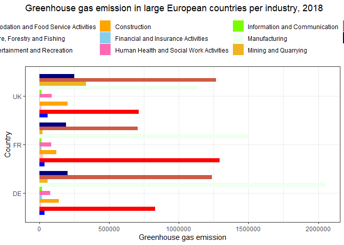<!-- -->

In the case above, I used `scale_fill_manual` because I used `fill` to
define the categories. Had I used `color` to define the categories and
wanted to pick my own colors, I’d use `scale_color_manual`. If my
`color` variable had been continuous and I wanted to reflect this in the
plot, I could use `scale_color_continuous`.

In the example below, I used `color` to define the categories. Also, I
use `brewer` here to refer to a ready-made color palette. For different
exisiting color palettes, consult the internet, for example [this
page](https://www.datanovia.com/en/blog/top-r-color-palettes-to-know-for-great-data-visualization/).

``` r
green_research %>%
  mutate(time = as_factor(time)) %>% 
  filter(geo %in% c("DE", "FR", "UK")) %>% 
  filter(industry == "TOTAL") %>% 
  ggplot(aes(time, GHG, group = geo, color = geo)) + 
  geom_line(size = 1.5) +
  scale_color_brewer(palette = 2) + # Choosing color palette no. 2
  theme_dark() # Choosing theme_dark
```

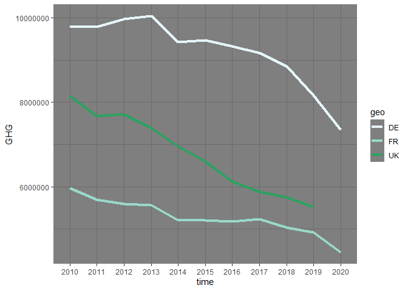<!-- -->

Coloring a plot can be quite tricky, but trying and error gets you there
eventually. Personally, I use [this
page](http://www.sthda.com/english/wiki/ggplot2-legend-easy-steps-to-change-the-position-and-the-appearance-of-a-graph-legend-in-r-software)
quite a lot when trying to color my plots.

### Facets

Facets are also a rather common practice with plots. Once again, they
allow us to divide plots by categories, hopefully making them more
readable. What facets do, is that they create small plots for each
category. To create a facet, use `facet_wrap` and and specify the name
of the variable where you want one plot per unit. Here, I use the
geo-variable. Also, remember to add the `~`.

You can also use `facet_grid`. This puts the plots side by side, instead
of in a square.

``` r
green_research %>%
  mutate(time = as_factor(time)) %>% 
  filter(industry == "TOTAL") %>% 
  ggplot(aes(time, GHG, group = geo, color = geo)) + 
  geom_line(size = 0.8) + 
  facet_wrap(~ geo) # Use "wrap" to get the plots stacked in a square
```

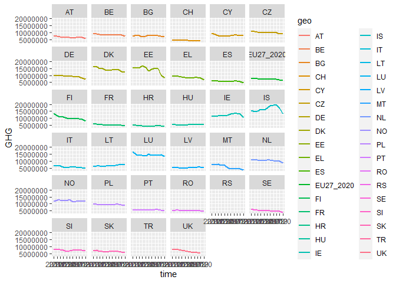<!-- -->

``` r
green_research %>%
  filter(geo %in% c("DE", "FR", "UK")) %>% # facet_grid works better for fewer categories, so I filter out just some countries
  mutate(time = as_factor(time)) %>% 
  filter(industry == "TOTAL") %>% 
  ggplot(aes(time, GHG, group = geo, color = geo)) + 
  geom_line(size = 0.8) + 
  facet_grid(~ geo) # Use "grid" to get the plots next to each other
```

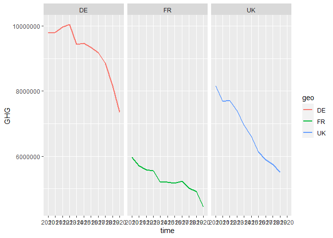<!-- -->

### Other

You can customize `ggplot` to become almost anything. We’ve been through
a few methods for customization here, but once you get the hang of the
technical aspects, the only limit is your creativity. Look things up on
the internet regularly, and you will see how much you can do.

For example, in the plot above, we might notice that the names of the
years are squeezed into each other. To change this, we can add the
`axis.text.x` function to `theme` with the argument `angle = 90` inside
`element_text()` to tell `ggplot` that we want the text on the x-axis
rotated 90 degrees.

``` r
green_research %>%
  filter(geo %in% c("DE", "FR", "UK")) %>% 
  mutate(time = as_factor(time)) %>% 
  filter(industry == "TOTAL") %>% 
  ggplot(aes(time, GHG, group = geo, color = geo)) + 
  geom_line(size = 0.8) + 
  facet_grid(~ geo) + 
  theme(axis.text.x = element_text(angle = 90)) # Turn the text on the x-axis 90 degrees
```

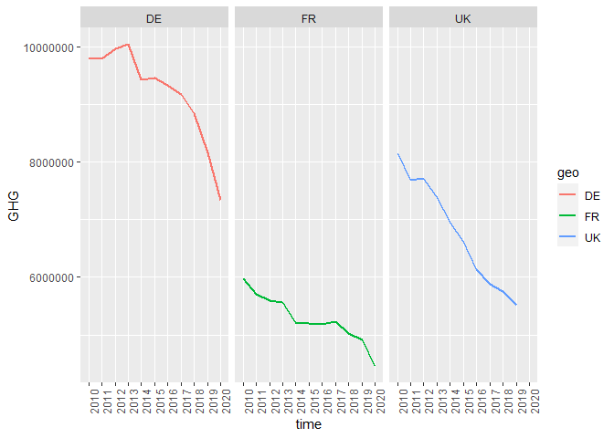<!-- -->

Should you want several plots side by side, one option is to use
`gridExtra`. Another option is `cowplot`.

``` r
library(gridExtra)

plot1 <- gapminder::gapminder %>%
  ggplot(aes(lifeExp)) +
  geom_histogram()

plot2 <- green_research %>%
  ggplot(aes(geo, GHG)) +
  geom_bar(stat = "identity")

plot3 <- green_research %>%
  ggplot(aes(GHG, rnd)) + 
  geom_point()

plot4 <- green_research %>%
  ggplot(aes(geo, GHG)) +
  geom_boxplot()

grid.arrange(plot1, plot2, plot3, plot4)
```

<!-- -->

[^1]: Or figure or plot – a beloved child has many names, as we say in
    Norwegian

[^2]: Even though the name of the package is `ggplot2`, I refer to it
    sometimes as just `ggplot`
